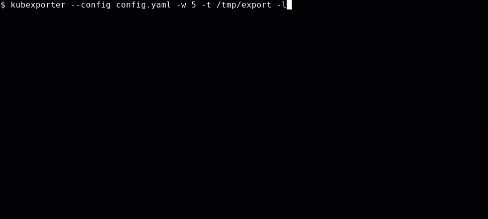

[](https://github.com/bakito/kubexporter/actions?query=workflow%3AGo)
[](https://quay.io/repository/bakito/kubexporter)
[](https://goreportcard.com/report/github.com/bakito/kubexporter)
[](https://github.com/bakito/kubexporter/releases)

# KubExporter

KubExporter allows you to export resources from kubernetes as yaml/json files.

The configuration allows customization on which resources and which fields to exclude.

## Usage

```bash
Usage:
  kubexporter [flags]

Flags:
  -l, --as-lists                If enabled, all resources are exported as lists instead of individual files
  -c, --clear-target            If enabled, the target dir is deleted before running the new export
      --config string           config file (default is $HOME/.kubexporter.yaml)
  -e, --exclude-kinds strings   Do not export excluded kinds
  -h, --help                    help for kubexporter
  -i, --include-kinds strings   Export only included kinds, if included kinds are defined, excluded will be ignored
  -n, --namespace string        If present, the namespace scope for this export
  -f, --output-format string    Set the output format [yaml(default), json] (default "yaml")
  -q, --quiet                   If enabled, output is prevented
  -s, --summary                 If enabled, a summary is printed
  -t, --target string           Set the target directory (default exports)
  -v, --verbose                 If enabled, errors during export are listed in summary
      --version                 version for kubexporter
  -w, --worker int              The number of worker to use for the export (default 1)

```



### Config

KubExporter exports by default all resources and allows to exclude unwanted resources.
The benefit is that new custom resource definitions are automatically considered in the export.


Example configuration

```yaml
summary: true # print a summary
progress: true # print progress
archive: true # create an archive
namespace: # define a single namespace (default all)
worker: 1 # define the number of parallel worker
outputFormat: yaml # yaml (default) or json
asLists: false # export as lists
clearTarget: true # clear the target directory before exporting
excluded:
  kinds: # list all kinds to be excluded
    - Binding
    - ComponentStatus
    - Endpoints
    - Event
    - LimitRange
    - LocalSubjectAccessReview
    - PersistentVolume
    - Pod
    - ReplicationController
    - ReplicationControllerDummy
    - RoleBindingRestriction
    - Secret
    - apps.ReplicaSet
    - batch.Job
    - build.openshift.io.Build
    - events.k8s.io.Event
    - extensions.ReplicaSet
    - image.openshift.io.Image
    - image.openshift.io.ImageSignature
    - image.openshift.io.ImageStreamImage
    - image.openshift.io.ImageStreamImage
    - image.openshift.io.ImageStreamImport
    - image.openshift.io.ImageStreamMapping
    - image.openshift.io.ImageStreamTag
    - security.openshift.io.PodSecurityPolicyReview
    - security.openshift.io.PodSecurityPolicySelfSubjectReview
    - security.openshift.io.PodSecurityPolicySubjectReview
    - user.openshift.io.UserIdentityMapping
  fields: # list fields that should be removed for all resources before exported
    - [ status ]
    - [ metadata, uid ]
    - [ metadata, selfLink ]
    - [ metadata, resourceVersion ]
    - [ metadata, creationTimestamp ]
    - [ metadata, generation ]
    - [ metadata, annotations, "kubectl.kubernetes.io/last-applied-configuration" ]
  kindFields: # kind specific excluded fields
    Service:
      - [ spec, clusterIP ]
    image.openshift.io.ImageStream:
      - [ annotations, "openshift.io/image.dockerRepositoryCheck" ]
included:
  kinds: [] # if only certain resources should be exported the included list can be used. If defined all other resources will be excluded.
```
